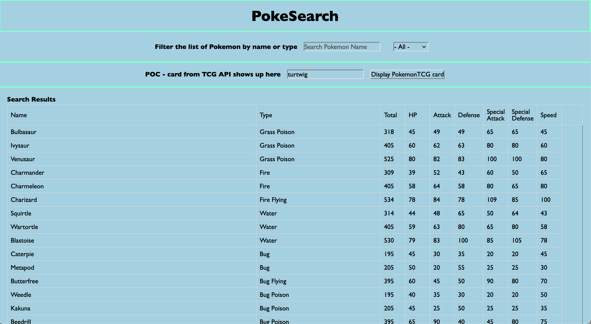
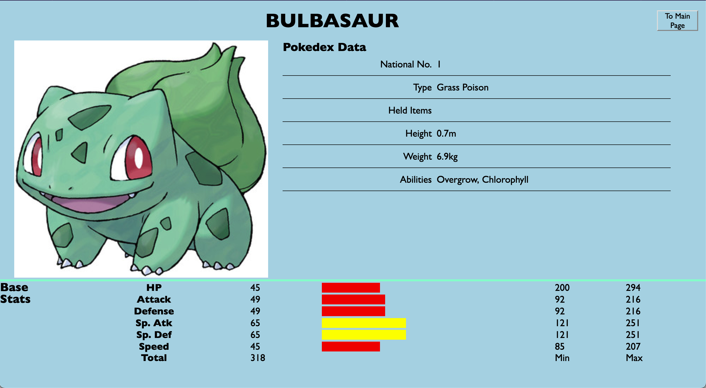

# poke-search

## Description

"Poke-Search" is a website that allows users to search pokemons based off name, while displaying the pokemon's stats and typing. By clicking on certain pokemons, the user will be transported into a details page listing out the individual pokemon stats generated from a locally sourced public Pokedex API  (https://pokeapi.co/?ref=public_apis). Along with this, the user may also search for a Pokemon Trading Card Game card by entering the desired pokemon's name or a key word that connects to the card in the search field for TCG. All information and images for this section are sourced from the TCG API (https://dev.pokemontcg.io/dashboard).

The creation of Poke-Search is for several students in the Columbia University Full-Stack Bootcamp to grasp a clear understanding of collaboration while utilizing development skills obtained in the last three weeks.

## Technologies Used

- HTML: Used to create the structure of the web pages.
- CSS: Used for styling the HTML elements.

    Files: reset.css, generalStyle.css, style.css

- JavaScript: The programming language used to add interactivity to the web pages and to fetch data from APIs.

    Files: script.js, common.js

- jQuery: A JavaScript library used for DOM manipulation and event handling.

    CDN: https://code.jquery.com/jquery-3.5.1.min.js

- PokeAPI: A RESTful API used to fetch Pokedex data and Pokémon details.
- Pokémon TCG API: A RESTful API used to fetch details about Pokémon Trading Card Game cards.
- Local Storage: A web storage API used to store the Pokedex data locally in the browser.
- Intersection Observer API: A JavaScript API used for lazy loading of details stats in search results.

## Screenshots

## Deployment Link:

https://maucap20.github.io/poke-search/

## Credits

As referenced above, Poke-Search is a simpler version of the Pokemon Database (https://pokemondb.net/) utilizing a public Pokedex API (https://pokeapi.co/?ref=public_apis). API utilized within Poke-Search is a free online resouce that we claim no credit for.